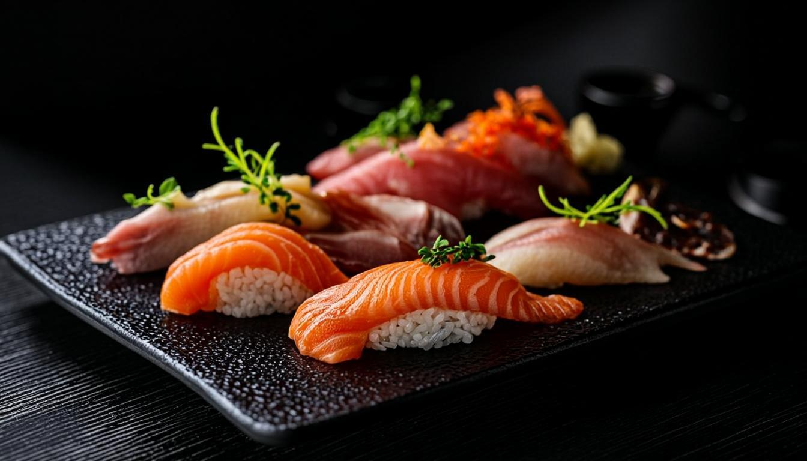

# ZEN Sushi · Bethel, AK

A premium, animation-rich restaurant website for **ZEN Sushi** — a family-run Japanese, Korean, Chinese & American cuisine restaurant in Bethel, Alaska.



## ✨ Features

- **Cinematic preloader** — animated ZEN logo reveal with progress bar (sessionStorage-gated so it only shows on first visit)
- **Hero section** — full-viewport parallax with Ken Burns + staggered headline reveal
- **Story section** — family-run narrative with image stack and stats
- **Tabbed menu** — 30+ dishes across 4 cuisines (Sushi, Korean, Chinese, American) with dietary tags
- **Gallery** — masonry grid with tap-to-zoom lightbox (keyboard navigable)
- **Reviews carousel** — auto-rotating with dot navigation
- **Visit section** — dark-themed Google Maps embed, today's hours auto-highlighted
- **Full ordering system** — add to cart, quantity controls, checkout form (name, email, phone, address, notes), order confirmation
- **Premium animations** — Framer Motion throughout (parallax, scroll reveals, staggered entrances)
- **Mobile-first** — sticky bottom action bar, mobile drawer, all 44px+ tap targets
- **Accessibility** — keyboard navigation, ARIA labels, semantic HTML, focus states
- **Security hardened** — CSP, sandboxed iframe, referrer policy, permissions policy

## 🛠 Tech Stack

- **Framework**: Next.js 16 (App Router)
- **Language**: TypeScript 5
- **Styling**: Tailwind CSS 4
- **UI Components**: shadcn/ui (New York style)
- **Animations**: Framer Motion
- **State**: Zustand (cart) + localStorage persistence
- **Toasts**: Sonner
- **Icons**: Lucide React
- **Fonts**: Cormorant Garamond (display) + Inter (body)

## 🚀 Getting Started

```bash
# Install dependencies
bun install

# Start dev server
bun run dev

# Build for production
bun run build

# Start production server
bun run start
```

The app runs on `http://localhost:3000`.

## 📁 Project Structure

```
src/
├── app/
│   ├── layout.tsx          # Root layout, fonts, metadata, preloader
│   ├── page.tsx            # Main page composition
│   ├── globals.css         # Theme + custom CSS
│   └── not-found.tsx       # Custom 404
├── components/
│   ├── ui/                 # shadcn/ui components
│   └── zen/                # ZEN Sushi components
│       ├── preloader.tsx       # Premium loading screen
│       ├── navbar.tsx          # Sticky scroll-aware nav
│       ├── hero.tsx            # Cinematic hero
│       ├── about.tsx           # Story section
│       ├── menu.tsx            # Tabbed menu with Add to Order
│       ├── gallery.tsx         # Masonry + lightbox
│       ├── reviews.tsx         # Carousel
│       ├── visit.tsx           # Map + hours + contact
│       ├── footer.tsx          # Footer
│       ├── cart-store.ts       # Zustand cart store
│       ├── cart-button.tsx     # Floating cart button
│       ├── cart-drawer.tsx     # 3-step checkout flow
│       ├── order-modal.tsx     # Quick order options modal
│       ├── scroll-progress.tsx # Top progress bar
│       ├── mobile-action-bar.tsx # Mobile bottom bar
│       └── back-to-top.tsx     # Floating scroll-to-top
└── lib/
    └── utils.ts            # cn() helper
```

## 🎨 Design System

- **Palette**: Ink black (`#0a0a0e`), Ivory, Vermilion red (`#c8102e`), Gold accent
- **Typography**: Cormorant Garamond for headlines, Inter for body
- **Animations**: Smooth scroll, parallax, ken burns, staggered reveals

## 📦 Ordering System

The cart uses Zustand with localStorage persistence. Orders are currently saved to the client's localStorage under `zen-orders`. To wire up a backend:

1. Create an API route at `src/app/api/orders/route.ts`
2. Replace the `localStorage.setItem` call in `cart-drawer.tsx` with a `fetch('/api/orders', ...)` call
3. Use the included Prisma setup for the database

## 🔒 Security

- Content-Security-Policy with strict directives
- Sandboxed Google Maps iframe
- All external links use `rel="noopener noreferrer"`
- `reactStrictMode` enabled
- No secrets in the repository

## 📝 License

Proprietary — ZEN Sushi, Bethel, AK.
